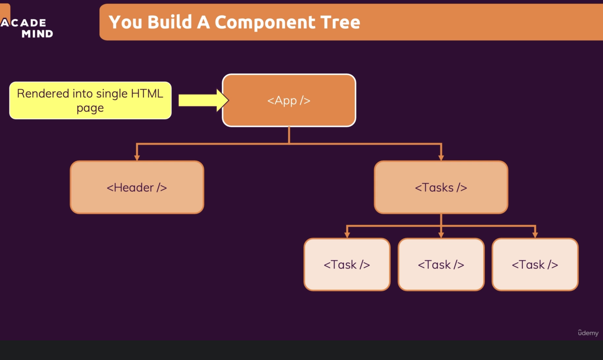

Basically each component is a different react js file. You will have dozens/hundreds of components in your project.

A component in react is just a javascript function.

# Why components?

- Reusability
Don't repeat yourself

- Seperation of concerns
Don't do too many things in one and the same place (function)

