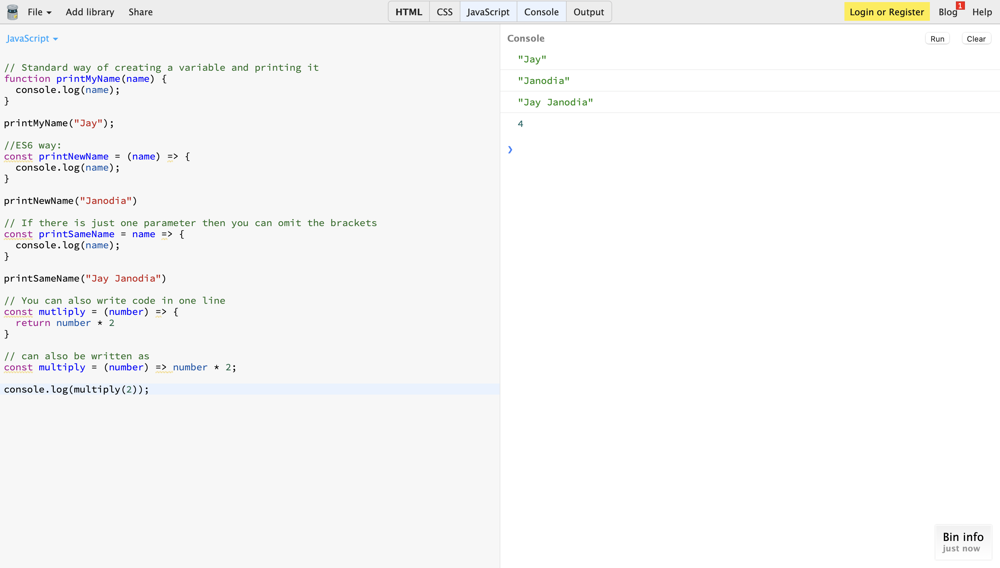

Usually a function in JavaScript is defined as 

function myFunc() {
    ...
}

Or can also be defined as 

var myFunc() {
    ...
}

However, in ES6, you need to define it using an arrow function

const myFunc = () => {
    ...
}

This gets rid of the issues with the **this**  keyword.

